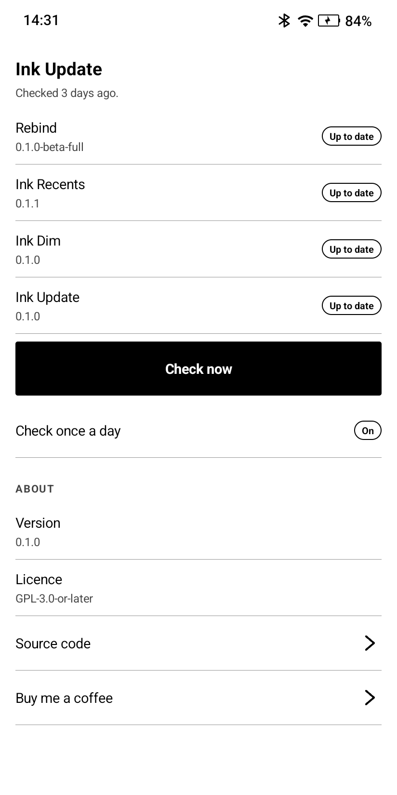

# Ink Update

Watches Rebind and its extensions, and tells you when a new version is ready.

The app does not install anything. It finds the new version, makes a
notification, and opens the page. You install it.

Made for e-ink readers and any Android 12 or later.

## Screenshots

  

The picture is from a Viwoods AiPaper Reader.

## Why this is a separate app

Rebind has no internet permission. This app has it, so Rebind does not need it.

An app that looks for updates must reach the network. An app that reads your
buttons must not. So the two jobs live in two apps. You can remove this one at
any time, and Rebind keeps working.

## What it watches

- Rebind
- Ink Recents
- Ink Dim
- Ink Update

The app shows only the ones that are on your device.

## Where it looks

The app tries three places, in this order.

1. **F-Droid.** The app asks F-Droid for the newest build of the package. If
   F-Droid has a newer one, the app opens the F-Droid page. The F-Droid client
   does the install.
2. **Google Play.** Google Play has no public way to ask. So the app asks the
   system which app did the install. If Google Play did the install, Google
   Play updates the app, and Ink Update stops there. The row says
   "Play updates this app". There is no notification.
3. **GitHub.** The app reads the last ten releases of the repository and takes
   the newest one that is not a draft. Every Rebind release is a pre-release,
   so the app cannot use the "latest release" address.

## What it sends

Two hosts, and nothing else:

    https://f-droid.org/api/v1/packages/<package>
    https://api.github.com/repos/<owner>/<name>/releases?per_page=10

Each request carries the package name or the repository name, and a User-Agent
that names this app. There is no identifier, no account, no advertisement and
no analytics. See [PRIVACY.md](PRIVACY.md).

## Use

- **Check now** looks at each installed app.
- **Check once a day** keeps a daily check. It lives through a restart.
- A row with an update opens the page for that app.
- A notification says "Rebind 0.0.16-alpha is ready". Tap it for the page.
  Tap **Download** for the APK.

## Start it from somewhere else

One intent action:

    dev.equwal.inkupdate.CHECK

Example with adb:

    adb shell am start -a dev.equwal.inkupdate.CHECK

Rebind can put this on a hardware button.

## Install

Download the APK from the Releases page and install it.

Open the app once. It asks for the notification permission and does the first
check.

## More extensions

[Awesome Rebind](https://github.com/equwal/awesome-rebind).

## Say thanks

Ink Update is free and open source. If it made your device better, you can
[buy me a coffee](https://ko-fi.com/truex).

## Build

You need JDK 17 or later and the Android SDK, with platform 36.

    ./gradlew testReleaseUnitTest assembleRelease

The APK is in `app/build/outputs/apk/release/`.

The APK has no dependency. The app uses `java.net.HttpURLConnection`, the
`org.json` of the platform, and `JobScheduler`.

Release signing is optional. Put a `keystore.properties` file in the root of
the project with `storeFile`, `storePassword`, `keyAlias` and `keyPassword`.
Without that file the build makes an unsigned APK.

## More projects

- [SubRead](https://subread.space/): read along with an audiobook, in the browser.
  Also [for Android](https://github.com/equwal/subread-android/releases/latest),
  [for YouTube](https://github.com/equwal/subread-extension/releases/latest)
  and [for KOReader](https://github.com/equwal/subread.koplugin).
- [SubRead Overlay](https://github.com/equwal/subread-overlay/releases/latest): subtitle lines over any Android media player.
- [SubRead Dictionary](https://github.com/equwal/subread-dictionary/releases/latest): a pop-up dictionary for Android that reads Yomitan dictionaries.
- [SubRead Anki](https://github.com/equwal/subread-anki): one tap makes an Anki card from any Android app.
- [Subrep](https://github.com/equwal/subrep-android/releases/latest): live captions of the sound of your phone.
- [Book Simulator](https://booksimulator.com/): a reading room for Aozora Bunko and Project Gutenberg books.
- [honjimaku.com](https://honjimaku.com/): subtitles for Japanese audiobooks.
- [sbm Sync](https://sbmsync.com/): your bookmarks, the same on every device,
  with [sbm](https://github.com/equwal/sbm) for dmenu,
  [sbm for Android](https://github.com/equwal/sbm-android/releases/latest)
  and the [sbm add-on](https://github.com/equwal/sbm-extension/releases/latest) for Firefox and Chrome.
- [Rebind](https://github.com/equwal/rebind/releases): remap the hardware buttons of e-ink readers and Android,
  with [Ink Recents](https://github.com/equwal/ink-recents/releases/latest),
  [Ink Dim](https://github.com/equwal/ink-dim/releases/latest)
  and [Ink Update](https://github.com/equwal/ink-update/releases/latest).
- [dickt.store](https://dickt.store/): language-learning tools, flashcards and web toys.
- [hentaibun.online](https://hentaibun.online/): learn kanbun and kobun.
- [Recently Written](https://recentlywritten.com/): the blog, and a list of [all projects](https://recentlywritten.com/projects.html).

## Licence

GPL-3.0-or-later. See [LICENSE](LICENSE).

Copyright (c) 2026 equwal.
